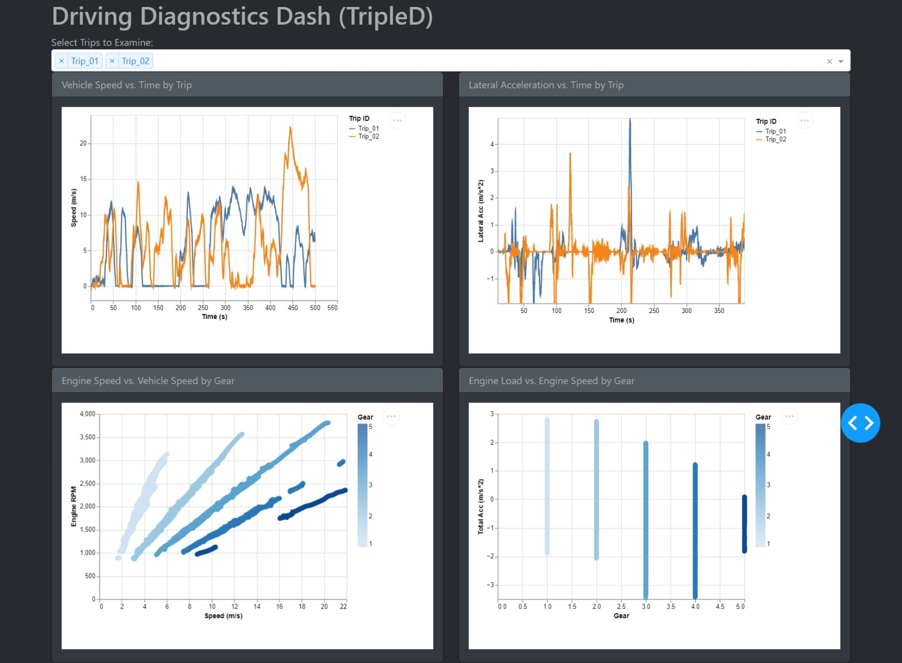

# **Driving Diagnostics Dash (TripleD)**
## _Making Sure it's Working How it's Supposed to._

## Welcome!

Thanks for taking the time to look into the `TripleD` dashboard repository. This file is the primary source of information about how to navigate the dashboard and the repo. Please scroll on to read more about the project. You can find the deployed app [here](https://driving-diagnostics-dash-tripled.onrender.com/). Please note that due to the size of the data, the dashboard will take a very long time to update.

## **Who am I?**

My name is Vikram and I am automotive enthusiast with a passion for data and diagnostics. At the time of writing, I am close to wrapping up my course work at the University of British Columbia in my Master's of Data Science. I was tasked with creating a dashboard using Dash in Python to demonstrate my abilities with data visualization. With a background in Automotive Engineering and a passion for Data, I wanted to develop a project that was the best of both worlds. 

## **What am I Doing?**

I understand that tuning a vehicle, whether for fun or professionaly, can be a lot of back and forth with test runs and laps. You can end up with messy notebooks trying to keep track of things, and with the number of sensors and data points you can use organizing the data for visualization can be very difficult. I aimed to create a dashboard that can help a tuner visualize their data in a neat and organized fashion and display the diagnositcs plots that matter to them.

## **Description of the Dashboard**
For the sake of having too much school work to delve deep into this passion project, the dashboard will be kept simple and straightforward. The dashboard is used to display diagnostic plots of test runs/laps to be able to explore how the vehicle reacts after tuning.

For race enthusiasts, I know that vehicle speeds and accelerations are extremely important for lap times. I have included two important plots for this. The first is a vehicle speed versus time plot to show the vehicle velocities over the duration of the test run. The second is a plot of the lateral accelerations verus time to extract information about the cornering ability.

For those who are tinkering DIY, I know that engine diagostics can be important after applying tunes to the vehicle. For this I have also created two plots. The first being a Engine Speed verus Transmission Gear plot to show the different shift speeds. The second is the Engine Load versus Engine Speed to see the capabilities of tune through different scenarios.

For now, there is a single widget at the top that will allow you to select which trips you would like to plot. For example if you want to plot a test run with a high A/F ratio on top of a test run with a low A/F ratio, you can compare results on a single set of plots.

Below you can see a screenshot of the full working app. However for the sake of the project, the data has been trimmed down and reduced for ease of deployment.

## Attributions
The data has been collected and adapted from [here](https://www.kaggle.com/datasets/vitorrf/cartripsdatamining)

## **License**
`TripleD` was created by Vikram Grewal and is licensed under the terms of the MIT License.